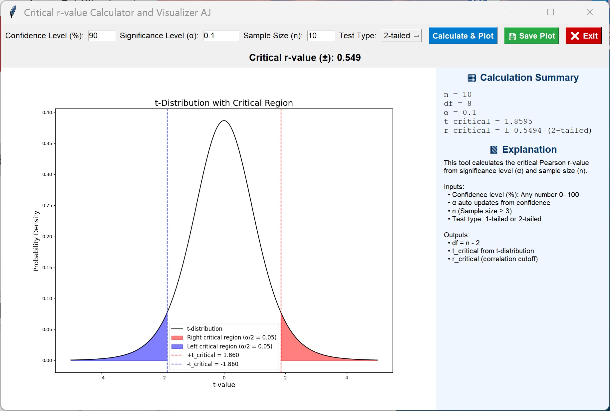
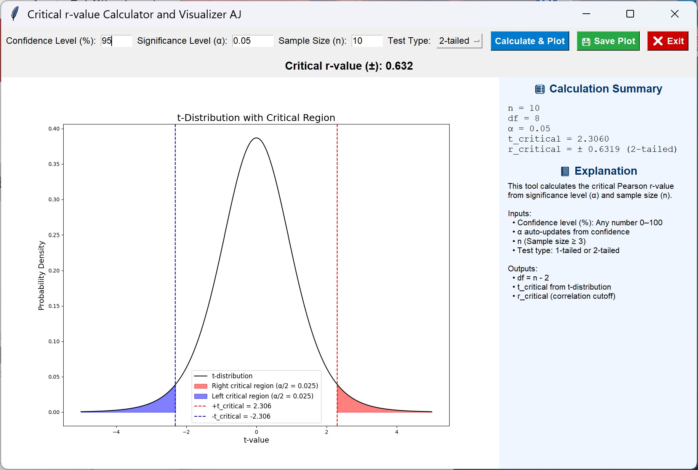
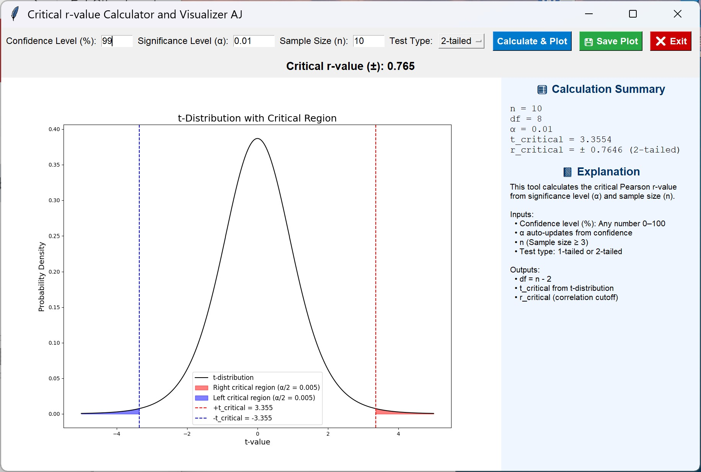
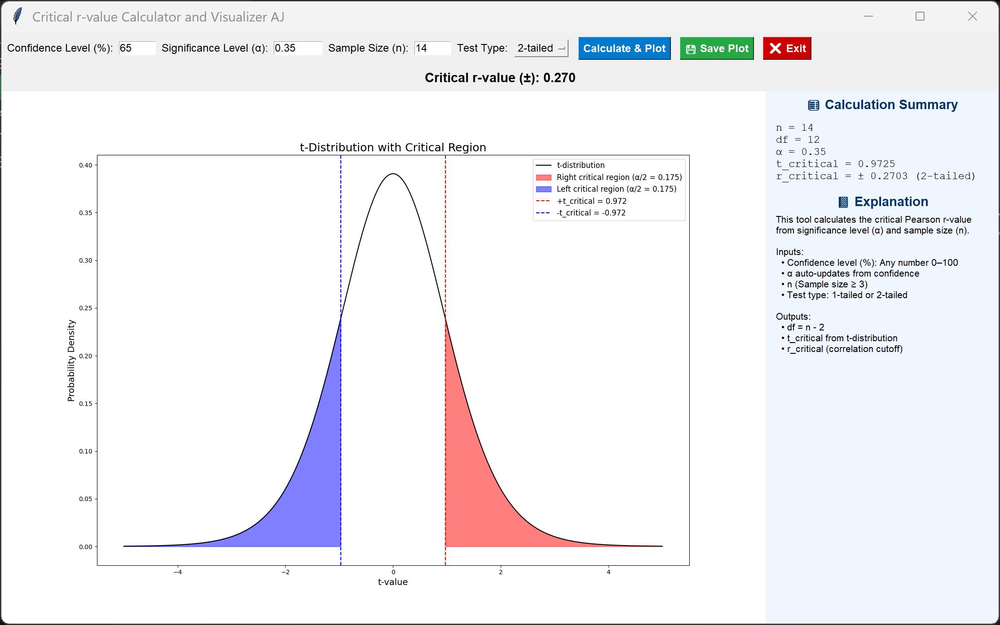

# 📊 **Critical r-value Calculator & Visualizer by AJ**

> 🎓 A no-code, visual approach to mastering **statistical significance** and **Pearson correlation thresholds** — ideal for learning, teaching, and real-world analysis.

---

## 🧾 About This Project

This application was created as part of my personal portfolio to demonstrate my ability to design clean, functional, and mathematically-accurate software tools for data analysis and education perfect for Statistics I MAT-181.

**Critical r-value Calculator & Visualizer** is more than just a calculator — it's a learning assistant. Designed for both beginners and professionals in statistics, the app simplifies complex statistical formulas into an interactive, visual experience. It reflects my interests in:

* Applied statistics
* GUI design and usability
* Data-driven decision-making
* Clear scientific communication

This project showcases my proficiency in **Python 3**, **Tkinter**, **matplotlib**, and statistical logic implementation, while focusing on clean UX principles and code modularity.

---

## 🔽 Download

📦 Grab the latest stable release:
➡️ **[Download v4.1 for Windows (.exe)](https://github.com/jentimanatol/CriticalRValueConfidence/releases/download/v1.1/CriticalRValueConfidence.exe)**

📁 Need older versions or want to check the source code?
🔍 **[Browse all releases](https://github.com/jentimanatol/CriticalRValueConfidence/releases)**

---

## 🚀 Features Overview

* 🔢 **Instant r-value calculation** using input α and sample size
* 📈 **Live plot visualization** of r_critical values vs. sample size
* 💾 **Save your graph** as PNG — perfect for academic reports
* 📘 **Transparent formula explanations** with each result
* 🎨 **User-friendly GUI**, optimized for clarity and focus

---

## 🧑‍🏫 Who Should Use This?

This app is tailored for:

* 📚 **Students** learning statistical significance and hypothesis testing
* 🧪 **Researchers** working with correlation coefficients
* 👩‍🏫 **Teachers & professors** explaining r-value thresholds
* 📊 **Data analysts** validating correlation strength in datasets

Whenever you're working with **Pearson correlation coefficients**, it’s critical to assess whether your r-value is statistically significant. This app helps **demystify that threshold** and lets you explore how it evolves with varying sample sizes and confidence levels.

---

## 🛠️ How It Works

1. **Enter Significance Level (α)**
   Example: `0.05` (which represents 95% confidence)

2. **Enter Sample Size (n)**
   Must be `3` or more (e.g., `14`, `25`, `100`)

3. **Click “Calculate & Plot”**
   The app will generate:

   * Critical r-value (both positive and negative)
   * Degrees of freedom and t-critical value
   * Formula explanation
   * A plot showing r_critical as n increases

4. **Click “💾 Save Plot”**
   Instantly export the chart as a `.png` file for documentation or presentations.

---

## 🖼️ App Preview

*A clear, interactive interface for exploring statistical thresholds.*

---

## 🧠 Core Mathematical Concepts

\`\`\`txt
Degrees of Freedom (df): df = n - 2  
t-critical:               Two-tailed t-distribution at chosen α  
r-critical formula:       r = t / √(t² + df)
\`\`\`

All calculations follow standard statistical principles and are dynamically updated based on input.

---

## 💡 Why I Built This

I created this project to bridge the gap between **theory and practice** in statistics. Too often, critical values are memorized or looked up in tables without true understanding. This tool encourages **exploration and experimentation**, helping users develop an intuitive grasp of how significance thresholds behave.

As a passionate learner and problem solver, I wanted to combine **statistical precision**, **code elegance**, and **accessibility** — all wrapped in a simple executable anyone can use.

---

## 🛠 Tech Stack

* `Python 3.11+`
* `Tkinter` (for GUI)
* `matplotlib` (for plotting)
* `threading` (for responsive user interaction)
* `PyInstaller` (for compiling to `.exe`)

---

## 📃 License & Credits

🆓 **MIT License** — free to use, modify, and distribute.

👤 Created by **Anatolie Jentimir**
📅 2025

*Feel free to use, improve, or fork this project. If you do, I’d love to see how it grows!*
